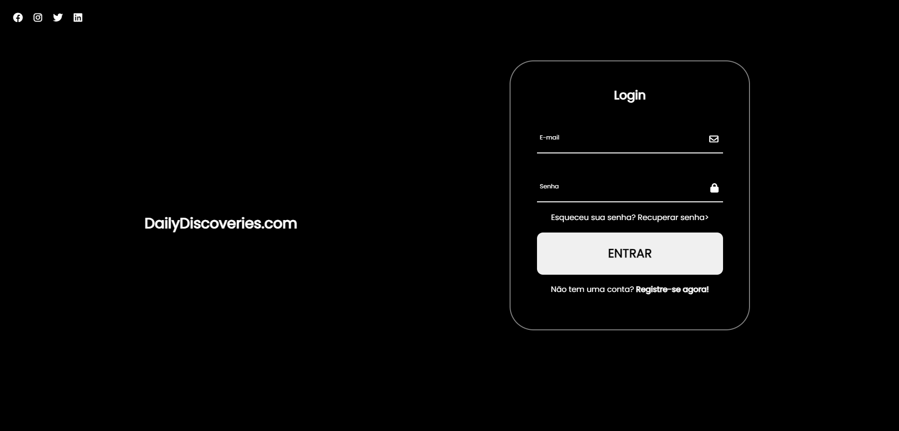

<h1 align="center"> Projeto-Formulário</h1>

Projeto produzido com intuito de colocar meus conhecimentos adquiridos em prática.

  <a href="#-tecnologias">Tecnologias</a>&nbsp;&nbsp;&nbsp;|&nbsp;&nbsp;&nbsp;
  <a href="#-projeto">Projeto</a>&nbsp;&nbsp;&nbsp;|&nbsp;&nbsp;&nbsp;
  <a href="#-layout">Layout</a>&nbsp;&nbsp;&nbsp;|&nbsp;&nbsp;&nbsp;
  <a href="#memo-licença">Licença</a>

  

 

## 🚀 Tecnologias

Esse projeto foi desenvolvido com as seguintes tecnologias:

- HTML e CSS
- Git e Github

## 💻 Projeto

Meu projeto é um formulário de acesso à conta que visa proporcionar uma experiência simplificada e segura para os usuários. 

## :memo: Licença

Esse projeto está sob a licença MIT.

---

Feito com ♥ by Luiz Arthur